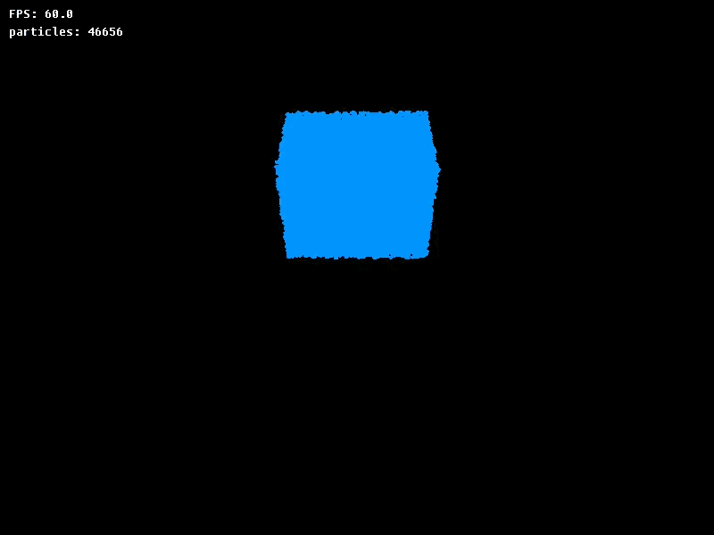

## Building
To get started, clone this repository with all the submodules:

```bash
git clone --recurse-submodules https://github.com/f01zy/Fluid-Simulation fluid-simulation && cd fluid-simulation 
```

If you have NixOS then run the nix-shell to load wayland, X11 and OpenGL dependencies:

```bash
nix-shell
```

And now build the project:

```bash
mkdir build && cd build
cmake ..
cmake --build .
```

## Usage

You can change the simulation settings in `settings.json`. There are some parameters:

- `duration`: the simulation duration (only if you choose the video mode).
- `flip-ratio`: a coefficient ranging from 0.0 to 1.0 that determines the behavior of fluid.
- `density`: the fluid density.
- `dx`: the gird cell size.
- `res`: the grid resolution.
- `lc`: the grid bottom-left-nearest corner position.
- `render-type`: `screen` or `video`.
- `particles`: the particles file path.

Also you can generate the particles file by the `scripts/generate_particles.py` script. then just run the simulation:

```bash
./fluid-simulation settings.json
```

## Preview



## Acknowledgments / References

- Chand T. John, ["Physics-Based Simulation & Animation of Fluids"](https://unusualinsights.github.io/fluid_tutorial/).

